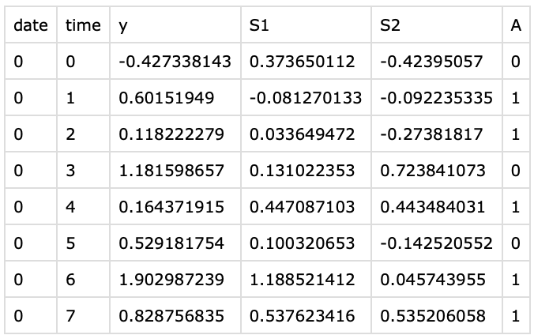

# CODE for “Dynamic conditional quantile treatment effects evaluation with applications to ridesharing”
This is the ReadMe document for running the simulation and real data analysis presented in the paper.

## Summary of the paper

Many modern tech companies, such as Google, Uber, and Didi, utilize online experiments (also known as A/B testing) to evaluate new policies against existing ones. While most studies concentrate on average treatment effects, situations with skewed and heavy-tailed outcome distributions may benefit from alternative criteria, such as quantiles. However, assessing dynamic quantile treatment effects (QTE) remains a challenge, particularly when dealing with data from ride-sourcing platforms that involve sequential decision-making across time and space. In this paper, we establish a formal framework to calculate QTE conditional on characteristics independent of the treatment. Under specific model assumptions, we demonstrate that the dynamic conditional QTE (CQTE) equals the sum of individual CQTEs across time, even though the conditional quantile of cumulative rewards may not necessarily equate to the sum of conditional quantiles of individual rewards. This crucial insight significantly streamlines the estimation and inference processes for our target causal estimand.  We then introduce two varying coefficient decision process (VCDP) models and devise an innovative method to test the dynamic CQTE. Moreover, we expand our approach to accommodate data from spatiotemporal dependent experiments and examine both conditional quantile direct and indirect effects. To showcase the practical utility of our method, we apply it to three real-world datasets from a ride-sourcing platform. Theoretical findings and comprehensive simulation studies further substantiate our proposal.

## 1. real data temporal code
This folder contains estimation code and plot code for the temporal data analysis in Section 6 of the paper.

* Demo_data.csv: a demo dataset, the columns correspond to the $i$-th day, the $t$-th time interval, the reward $y_{it}$ , and the two state variables $S_{1, i,t}$ and $S_{2, i,t}$

  

*  settings_multiple_S_simu.py: the estimation and testing function for the conditional quantile treatment effect.

* Quantile_RealData.py: estimate the conditional quantile treatment effects given data.

* linear_multiple_S.py: the estimation and testing function for the average treatment effect.

* Linear_RealData.py: estimate the average treatment effects given data

* Figures 3_4.R: code for generating Figures 3 -4 in the paper.

## 2. real data spatiotemporal code

This folder contains the estimation code and plot code for the spatiotemporal data analysis in section 6 of the paper.

*  Spatial_S_without_barA.py: the estimation and testing function for spatiotemporal conditional quantile treatment effect.
* RealData_Analysis_QTE.py: estimate quantile treatment effects given data.
* Spatial_linear_without_barA.py: the estimation and testing function for spatiotemporal average treatment effect.
* RealData_Linear.py: estimate the average treatment effects given data.
* Figure5.R: code for generating Figure 5 in the paper.

## 3. Simulation code

This folder contains the simulation demo code for simulation studies in Section 7.

*  settings_multiple_S_simu.py: the main estimation and testing function.

* simu_demo_data.csv: an data example to generate the simulation data, which is generated by the generate_temporalData function in settings_multiple_S_simu.py by 

  simu_data= generate_temporalData(40, 24, 1, 1, 0.5, 1, 0,0)

* settings_multiple.py: a simulation demo for the setting $(NN=40, TI=1, \tau=0.5, \delta=0)$ including generating data, estimation of QDE, QIE and the corresponding testing results. The generated data are based on the above simu_demo_data.csv.

* Competing methods

  *   noInterference_compare.py: the main estimation and testing function for the ``NoInterference'' method.
  * settings_noInterference_compare: a simulation demo for the setting $(NN=40, TI=1, \tau=0.5, \delta=0)$ for the ``NoInterference'' method.
  * Linear_multiple_S.py: the main estimation and testing function for the ``ATE'' method.
  * settings_linear.py: a simulation demo for the setting $(NN=40, TI=1, \tau=0.5, \delta=0)$ for the ``ATE'' method.

* ResidMultiple_NN_40_TI_1: this folder contains a simulation output sample for the setting$(NN=40, TI=1, \tau=0.5, \delta=0)$. We use the variables  'QTE_indicator_RightSide', 'QDE_indicator_RightSide', 'QIE_indicator_RightSide'  to calculate the empirical rejection rates of quantile treatment effect, the direct quantile treatment effect and the indirect quantile treatment effect.

* Figures6_7.R: code for generating Figures 6-7 in the paper.

